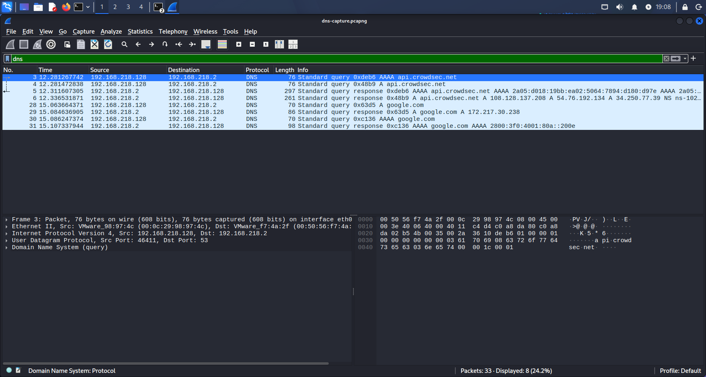
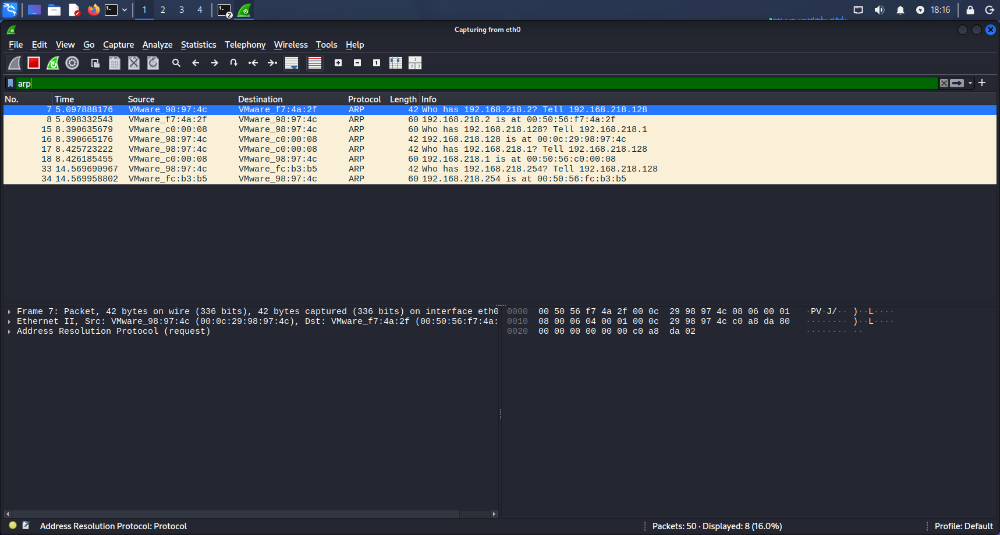
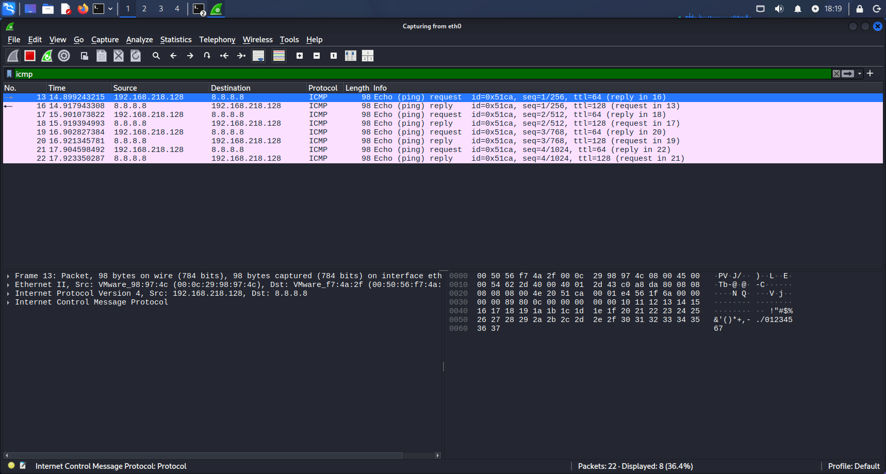
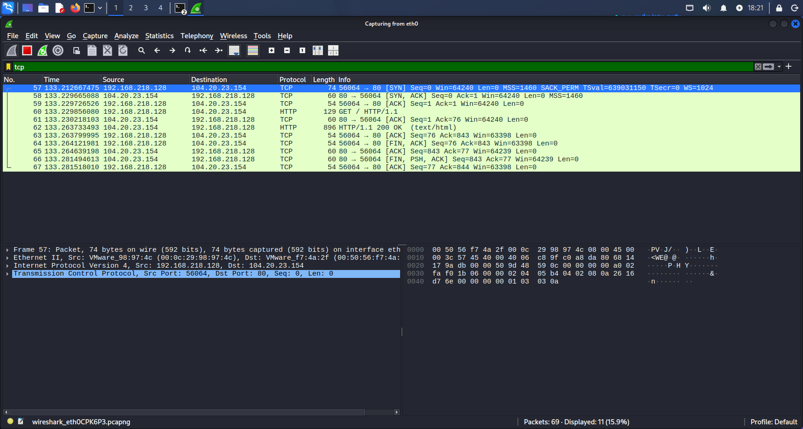
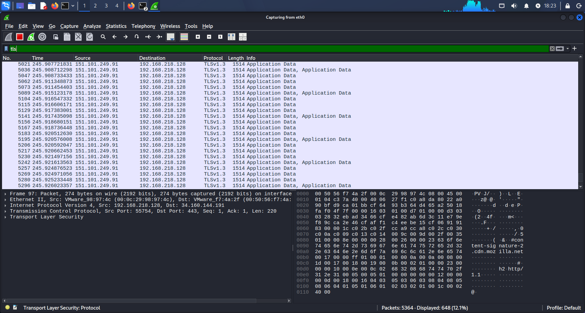

## Sumário

- [Objetivo](#objetivo)
- [Ambiente](#ambiente)
- [Protocolos Analisados](#protocolos-analisados)
- [Capturas Realizadas](#capturas-realizadas)
- [Estrutura do Projeto](#estrutura-do-projeto)
- [Próximos Passos](#próximos-passos)
- [Evidências](#evidências)
- [Laboratórios do SOC Home Lab](#-laboratórios-do-soc-home-lab)

# Wireshark Analysis Lab

## Objetivo

Laboratório de análise de protocolos de rede utilizando Wireshark.

## Ambiente

* Kali Linux
* VMware
* Wireshark

## Protocolos Analisados

* DNS
* ARP
* ICMP
* TCP
* HTTPS/TLS

## Capturas Realizadas

### DNS

Análise de resolução de nomes utilizando consultas DNS.

### ARP

Identificação do processo de resolução de endereços MAC.

### ICMP

Análise de Echo Request e Echo Reply utilizando ping.

### TCP

Visualização do processo de estabelecimento de conexão através do Three-Way Handshake.

### HTTPS/TLS

Observação do handshake TLS e comunicação criptografada.

## Estrutura do Projeto

* captures/
* screenshots/
* notes/
* filters/

## Próximos Passos

* Análise de DHCP
* Análise de HTTP
* Análise de VLANs
* Capturas avançadas

## Evidências

### DNS

### ARP

### ICMP

### TCP Handshake

### HTTPS/TLS

---

## 🔗 Laboratórios do SOC Home Lab

| Lab | Repositório | Descrição |
|-----|-------------|-----------|
| 🛡️ Wazuh SIEM/XDR | [wazuh-lab](https://github.com/gabrielzaccaferreira/wazuh-lab) | Instalação, configuração e regras customizadas do Wazuh |
| 🐉 Kali Linux | [kali-remote-access-lab](https://github.com/gabrielzaccaferreira/kali-remote-access-lab) | Setup do ambiente de ataque e acesso remoto |
| 🔍 Suricata IDS/IPS | [suricata-lab](https://github.com/gabrielzaccaferreira/suricata-lab) | Detecção de intrusão em rede, regras customizadas |
| 🛡️ CrowdSec | [soc-lab-crowdsec-kali](https://github.com/gabrielzaccaferreira/soc-lab-crowdsec-kali) | IPS colaborativo com blocklists dinâmicas |
| 🔬 Wireshark | [wireshark-analysis-lab](https://github.com/gabrielzaccaferreira/wireshark-analysis-lab) | Análise de tráfego e dissecção de protocolos |
| 🔥 pfSense | [pfsense-lab](https://github.com/gabrielzaccaferreira/pfsense-lab) | Firewall, NAT, VLANs e regras de perímetro |
| 🪟 Windows Server + Sysmon | [windows-server-soc-lab](https://github.com/gabrielzaccaferreira/windows-server-soc-lab) | Telemetria Windows, Sysmon, Red Team vs Blue Team |

> 🌐 Portfólio completo: [gabrielzacca.com.br](https://gabrielzacca.com.br)

